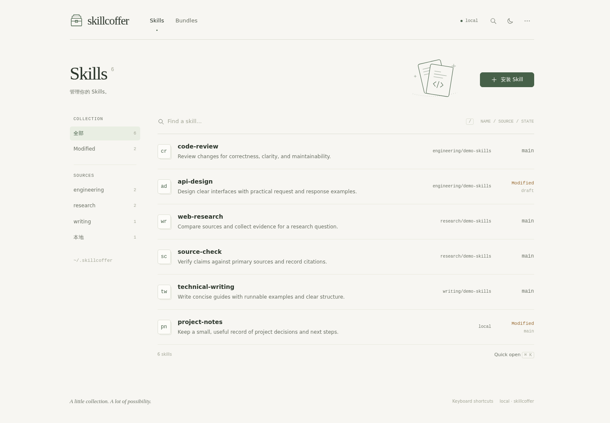
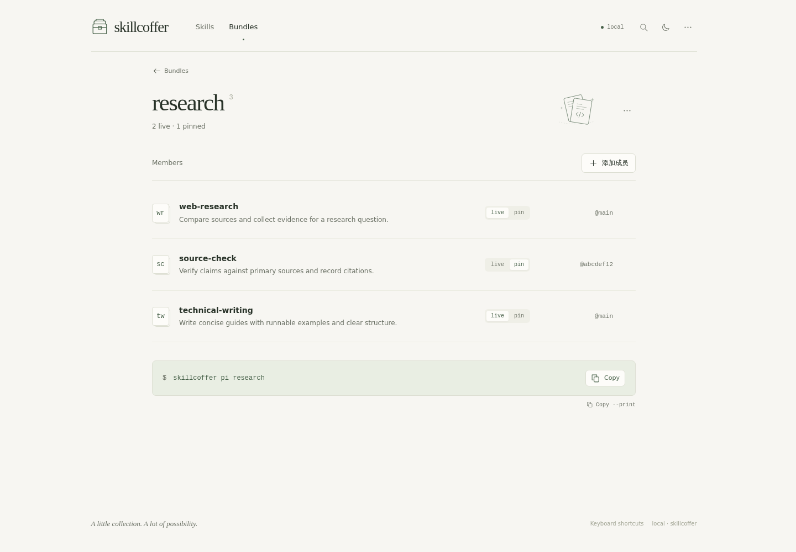

# skillcoffer

**Version, review, and compose Agent Skills without giving up local control.**

[简体中文](./README.md) | **English**

[](https://www.npmjs.com/package/skillcoffer)
[](./LICENSE)


skillcoffer turns loose [Agent Skills](https://agentskills.io) directories into an inspectable local workflow: install from disk or public GitHub, edit on independent branches, preserve known-good states as immutable snapshots, review upstream diffs before updating, and mount or compose exactly what a [pi](https://github.com/badlogic/pi-mono) session needs.

No database, hosted service, or new agent runtime is required. Use `skillcoffer`, or the equivalent short command `skco`.



<p align="center"><sub>The Skills library brings source filters, search, descriptions, and branch state into one view.</sub></p>

## Why skillcoffer

| Capability | What it does |
|------------|--------------|
| **Edit freely, roll back cleanly** | `save` creates an immutable snapshot; `restore` resets the current branch's work tree and HEAD to any snapshot without moving existing links. |
| **Review before updating** | Inspect upstream changes with `check` / `diff`, then explicitly run `update --apply`; GitHub refs resolve to recorded commit SHAs. |
| **Choose live iteration or reproducibility** | Live links follow editable work for rapid iteration; pinned links stay on an immutable version for important sessions. |
| **Compose capabilities per session** | A bundle can mix live and pinned skills, then generate or execute the matching `pi --skill ...` command. |
| **Keep ownership local** | State is ordinary directories, JSON, and symlinks that you can inspect, back up, and recover; the WebUI only listens on loopback. |

skillcoffer is not a replacement for Git, a remote marketplace, or an agent runtime. It focuses on the local lifecycle from skill installation and editing through review and use.

## Requirements

- Node.js 20 or newer
- Git for fetching GitHub sources
- `diff` for CLI and WebUI directory comparisons
- Linux or macOS; Windows junction/copy support is not implemented yet
- pi is optional and is only invoked by `skillcoffer pi ...`

## Installation

Install globally from npm ([view package](https://www.npmjs.com/package/skillcoffer)):

```bash
npm install -g skillcoffer
```

Verify both commands:

```bash
skillcoffer --help
skco --help
```

To run from the repository without a global install:

```bash
npm run skco -- --help
```

## Let an Agent Install and Learn skillcoffer

You do not need to clone or install anything first. Give this prompt directly to
an agent with terminal access:

```text
Install skillcoffer for yourself and learn how to use it:

1. Check whether `skco --help` works. If it does not, run
   `npm install -g skillcoffer`, then verify `skco --help`.
   Do not ask me to run these commands manually.
2. Use `skco` to install:
   https://github.com/Howryann/skillcoffer/tree/main/.agents/skills/skillcoffer-operations
3. Mount `skillcoffer-operations` live at
   `~/.agents/skills/skillcoffer-operations` so future agent sessions discover it.
4. If the CLI, skill, or mount already exists, inspect and reuse it. Do not delete
   the Store, overwrite ordinary files, or use `--force`.
5. Read `SKILL.md` under `skco path skillcoffer-operations` and immediately
   follow its workflow for the rest of this task; do not wait for a new session.
6. Run final status checks and report the CLI, skill, mount path, and verification
   results.
```

The current agent can then operate skillcoffer using the installed Skill, and
future sessions will discover it from `~/.agents/skills/`.

## Quick Start

### 1. Install a public GitHub skill

```bash
skillcoffer add anthropics/skills/skills/pdf --ref main
skillcoffer status pdf -v
```

You can also install a local directory, or a GitHub folder that contains multiple skills:

```bash
skillcoffer add ./my-skill
skillcoffer add anthropics/skills/skills --ref main
skillcoffer add 'https://github.com/anthropics/skills/tree/main/skills'
```

If the path itself contains `SKILL.md`, that one skill is installed. Otherwise every skill root under it is installed. Each skill keeps its own upstream, so `check` / `update` still run per skill. Existing local IDs are skipped, not overwritten.

### 2. Edit and save

```bash
skillcoffer path pdf
$EDITOR "$(skillcoffer path pdf)/SKILL.md"
skillcoffer status pdf
skillcoffer save pdf -m "Tune PDF extraction workflow"
```

`path` returns the editable directory for the active branch. Do not edit the installation source or a version tree directly.

### 3. Review and apply upstream changes

```bash
skillcoffer check pdf
skillcoffer diff pdf --upstream
skillcoffer update pdf --apply
```

`update` previews by default. It only writes a new upstream version when `--apply` is present.

### 4. Publish a saved Skill

```bash
skillcoffer publish pdf me/public-skills/skills/pdf --ref main
skillcoffer publish pdf
skillcoffer publish pdf --branch concise
```

The first successful publish binds the target, so later commands can omit it. Publication always uses the saved HEAD of the selected branch; unsaved changes are excluded. The command refuses to overwrite a target path changed outside skillcoffer.

### 5. Back up and restore the Store

```bash
skillcoffer backend push me/skill-vault
skillcoffer backend status
skillcoffer backend pull
```

The first successful operation binds one dedicated GitHub Backend. Push and pull are always explicit: push refuses a remote that advanced, while pull reports `diverged` when both local and remote changed. The first pull requires an empty Store. Create the repository beforehand; authentication comes from the system Git credential helper.

### 6. Use a skill in one pi session

```bash
skillcoffer pi pdf --print
skillcoffer pi pdf
skillcoffer pi pdf --pin
```

- The default uses current work.
- `--pin` uses the immutable version at HEAD.
- `--print` only displays the command that would run.

### 7. Compose several skills

```bash
skillcoffer bundle create research
skillcoffer bundle add research pdf --pin
skillcoffer bundle add research demo-skill
skillcoffer pi research --print
skillcoffer pi research -- --model your-model
```

Each bundle member can be live or pinned independently.

## Persistent Links

A skill can be linked to a common agent directory during installation:

```bash
skillcoffer add ./my-skill --agent pi
skillcoffer add ./another-skill --agent agents
skillcoffer add ./claude-skill --agent claude
```

Or provide an explicit symlink destination:

```bash
skillcoffer link pdf --to "$HOME/.pi/agent/skills/pdf"
skillcoffer unlink pdf --to "$HOME/.pi/agent/skills/pdf"
```

A live link immediately exposes unsaved changes in work. Use `--pin` when reproducibility matters.

## WebUI

```bash
skillcoffer ui --open
```

The default address is [http://127.0.0.1:7526](http://127.0.0.1:7526). Override it with `--port`. The server binds only to the local loopback interface.

The Skills list has a **检查更新** (Check updates) action with progress and cached results. Click the update count to filter, or a skill's **有更新** marker to open its upstream diff directly. The button tooltip shows the last check time; failed checks are shown separately. Updates are detected against the displayed branch's imported upstream baseline, so local edits and changes elsewhere in the repository do not produce false alerts. Checking never applies an update.

The WebUI provides Skills search and source filters, Markdown / Raw file views, diffs, version history, save and restore, upstream updates, links, bundles, and Doctor. Paper and dark themes share the same layout. Skill content remains editable in your own editor; interface copy uses Simplified Chinese alongside familiar technical terms.

- `/` focuses library search, `⌘/Ctrl K` opens a skill or bundle, and `⌘/Ctrl S` saves the selected branch.
- Files, Changes, and Versions share a branch selector. Viewing another branch does not change the CLI default.
- Links and Upstream live in the skill menu; Doctor and Store information live in the top toolbar.
- Bundles support multiple-member selection, live / pin switching, exact version selection, and undo after removing a member.



<p align="center"><sub>Bundle members, their live / pin refs, and the pi launch command share one page.</sub></p>

## Core Model

| Concept | Meaning |
|---------|---------|
| **Work** | The editable file tree for one branch |
| **Version** | An immutable snapshot created by installation, `save`, or update |
| **Branch** | A named line of work with its own work directory and HEAD |
| **Live link** | Points to work, so edits become visible immediately |
| **Pin link** | Points to a version tree and does not move after later saves |
| **Bundle** | A set of live or pinned skills for one pi session |

## CLI Reference

| Task | Commands |
|------|----------|
| Install and inspect | `add`, `list`, `status`, `path` |
| Versions | `save`, `versions`, `restore`, `discard` |
| Branches | `branch list`, `branch new`, `work-on` |
| Upstream | `check`, `diff`, `update` |
| Publication | `publish` |
| Store backup | `backend push`, `backend pull`, `backend status` |
| Links | `link`, `unlink` |
| Bundles | `bundle create`, `bundle add`, `bundle path`, `bundle list` |
| Launch pi | `pi <skill\|bundle>...` |
| Maintenance | `doctor`, `remove`, `demo`, `ui` |

Run `skillcoffer --help` for the complete command entry points. CLI output is currently human-oriented and is not a stable machine-readable interface.

## Store and Security Boundaries

The default store is `~/.skillcoffer`. Override it with an environment variable:

```bash
SKILLCOFFER_HOME=/path/to/store skillcoffer list
```

```text
$SKILLCOFFER_HOME/
  backend.json
  skills/<id>/manifest.json
  skills/<id>/versions/<version>/{version.json,tree/}
  skills/<id>/branches/<branch>/work/
  bundles/<name>/<skill> -> ...
```

- Installation, checks, and diffs never execute scripts from a skill.
- Skill trees entering the store cannot contain symlinks or special files.
- GitHub upstream refs are resolved to a concrete commit before use.
- The WebUI listens only on `127.0.0.1` and has no remote multi-user authentication.
- The store is local state; back it up like other development data.

Store writes use `.store-write.lock` for exclusion across processes. Backend push, pull, and status hold the lock throughout the sync or check. If another process reports `Store busy`, retry after the current operation finishes. The lock does not prevent editors from changing work files directly.

A crashed process can leave its lock behind. Stop every CLI and WebUI process using that Store, then remove only the `.store-write.lock` file named in the error and retry. Do not remove it while a writer could still be running; locks are never reclaimed automatically based on a PID or timeout. Restart older processes after upgrading, since the new lock cannot coordinate with versions using the prototype lock.

## Development

```bash
git clone https://github.com/Howryann/skillcoffer.git
cd skillcoffer
npm ci
npm test
npm run build
```

For WebUI development, run these commands in separate terminals:

```bash
node dist/cli.js ui
npm run dev:ui
```

The Vite development server proxies `/api` to local port `7526`.

## Contributing

Issues and pull requests are welcome. Before submitting a change, run:

```bash
npm test
npm run build
```

Please open an issue first for larger features so the scope can be agreed upon.

## Project Status

skillcoffer is in early development. Its core local workflows are usable, but the CLI, WebUI, and storage contract may still change incompatibly before `1.0`.

It does not currently include a remote skill marketplace, publishing service, first-class private GitHub support, shell completion, a Windows link fallback, or team permissions.

## License

[MIT](./LICENSE) © Howryann
