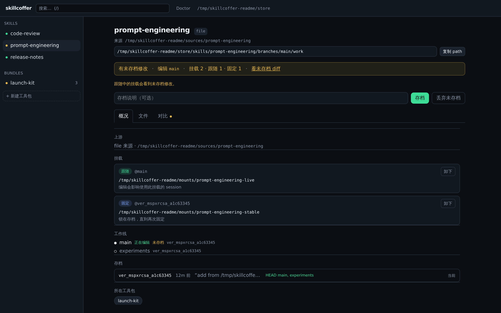
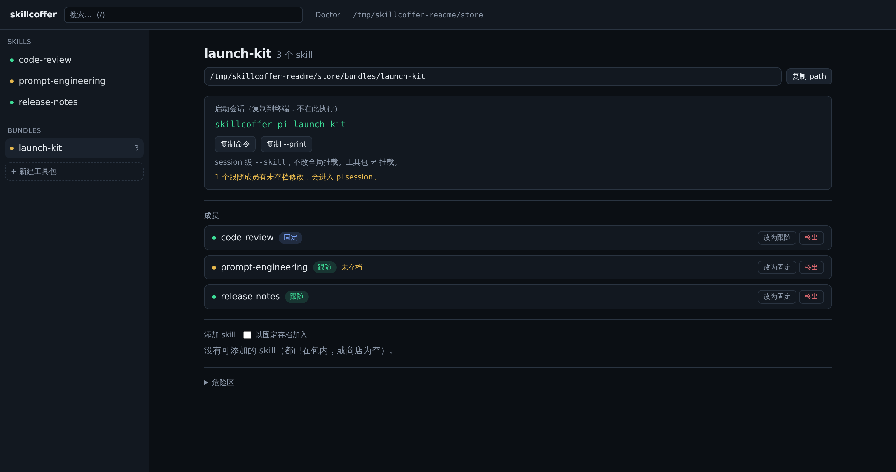

# skillcoffer

**让 Agent Skills 可版本化、可审查、可组合，同时留在本地。**

**简体中文** | [English](./README.en.md)

[](./LICENSE)


skillcoffer 把散落的 [Agent Skills](https://agentskills.io) 目录变成一套可检查的本地工作流：从本机或公开 GitHub 安装，在独立工作线中编辑，用不可变存档保留已知可用状态，审查上游 diff 后再更新，最后按需挂载或组合进 [pi](https://github.com/badlogic/pi-mono) 会话。

不需要数据库、托管服务或另一套 agent runtime。完整命令是 `skillcoffer`，`skco` 是完全等价的短命令。



<p align="center"><sub>真实 WebUI：未存档修改、工作线状态、live / pin 挂载与版本存档集中在同一视图。</sub></p>

## 为什么用 skillcoffer

| 能力 | 作用 |
|------|------|
| **放心修改，随时回退** | `save` 创建不可变存档；`restore` 将当前工作线的 work 与 HEAD 重置到任意存档，现有挂载不变。 |
| **先审查，再更新** | 先用 `check` / `diff` 看清上游变化，再显式执行 `update --apply`；GitHub ref 会解析并记录为 commit SHA。 |
| **实时迭代，也能固定复现** | live 挂载跟随工作目录，适合快速调整；pin 挂载锁定不可变版本，适合重要会话。 |
| **一次会话，一套能力** | Bundle 可混合多个 live / pin skill，并直接生成或执行对应的 `pi --skill ...` 命令。 |
| **本地、透明、可恢复** | 状态只是普通目录、JSON 和 symlink，可直接检查、备份与恢复；WebUI 仅监听本机回环地址。 |

skillcoffer 不是 Git 的替代品、远程市场或 agent runtime；它专注解决 skill 从安装、修改、审查到使用的本地生命周期。

## 环境要求

- Node.js 20 或更高版本
- Git，用于获取 GitHub 来源
- `diff`，用于 CLI 和 WebUI 的目录比较
- Linux 或 macOS；当前未实现 Windows junction/copy 模式
- pi 是可选依赖，只有 `skillcoffer pi ...` 会调用它

## 安装

使用 npm 全局安装：

```bash
npm install -g skillcoffer
```

确认两个命令都可用：

```bash
skillcoffer --help
skco --help
```

不需要全局安装时，可以在仓库内运行：

```bash
npm run skco -- --help
```

## 让 Agent 自己安装并学会 skillcoffer

不需要先手动 clone 或安装。把下面这段 Prompt 直接交给有终端权限的 Agent：

```text
请为自己安装并学会使用 skillcoffer：

1. 检查 `skco --help` 是否可用。如果不可用，运行
   `npm install -g skillcoffer`，然后验证 `skco --help`。不要要求我手动执行这些命令。
2. 使用 `skco` 安装：
   https://github.com/Howryann/skillcoffer/tree/main/.agents/skills/skillcoffer-operations
3. 将 `skillcoffer-operations` live 挂载到
   `~/.agents/skills/skillcoffer-operations`，供后续 Agent 会话自动发现。
4. 如果 CLI、Skill 或挂载已经存在，先检查现状并复用，不要删除 Store、覆盖普通文件，
   也不要使用 `--force`。
5. 读取 `skco path skillcoffer-operations` 下的 `SKILL.md`，立即按其中的流程继续操作，
   不要等到下一个会话。
6. 最后运行状态检查，报告 CLI、Skill、挂载路径和验证结果。
```

完成后，当前 Agent 已经可以按 Skill 中的流程操作 skillcoffer；新会话也会从
`~/.agents/skills/` 自动发现它。

## 快速开始

### 1. 安装一个公开 GitHub skill

```bash
skillcoffer add anthropics/skills/skills/pdf --ref main
skillcoffer status pdf -v
```

也可以安装本机目录：

```bash
skillcoffer add ./my-skill
```

skill 根目录必须包含 `SKILL.md`。

### 2. 编辑并保存

```bash
skillcoffer path pdf
$EDITOR "$(skillcoffer path pdf)/SKILL.md"
skillcoffer status pdf
skillcoffer save pdf -m "Tune PDF extraction workflow"
```

`path` 返回当前工作线的可编辑目录。不要直接修改安装来源或 version tree。

### 3. 检查并应用上游更新

```bash
skillcoffer check pdf
skillcoffer diff pdf --upstream
skillcoffer update pdf --apply
```

`update` 默认只预览；只有 `--apply` 才会写入新的上游版本。

### 4. 在一次 pi 会话中使用

```bash
skillcoffer pi pdf --print
skillcoffer pi pdf
skillcoffer pi pdf --pin
```

- 默认使用当前 work。
- `--pin` 使用当前 HEAD 的不可变版本。
- `--print` 只显示将执行的命令。

### 5. 组合多个 skill

```bash
skillcoffer bundle create research
skillcoffer bundle add research pdf --pin
skillcoffer bundle add research demo-skill
skillcoffer pi research --print
skillcoffer pi research -- --model your-model
```

Bundle 成员可以分别选择 live 或 pin。

## 持久挂载

安装时可以直接挂到常见 agent 目录：

```bash
skillcoffer add ./my-skill --agent pi
skillcoffer add ./another-skill --agent agents
skillcoffer add ./claude-skill --agent claude
```

也可以明确指定 symlink 目标：

```bash
skillcoffer link pdf --to "$HOME/.pi/agent/skills/pdf"
skillcoffer unlink pdf --to "$HOME/.pi/agent/skills/pdf"
```

live 挂载会立即看到 work 中尚未保存的修改；需要可复现行为时使用 `--pin`。

## WebUI

```bash
skillcoffer ui --open
```

默认地址为 [http://127.0.0.1:7526](http://127.0.0.1:7526)，可通过 `--port` 覆盖。服务只绑定本机回环地址。

WebUI 提供安装、状态、文件浏览、diff、save / restore、上游更新、挂载、Bundle 和 Doctor 操作；skill 内容仍由你自己的编辑器修改。



<p align="center"><sub>Bundle 可混合 live 与 pin 成员；dirty 的 live skill 会在进入会话前明确警告。</sub></p>

## 核心模型

| 概念 | 含义 |
|------|------|
| **Work** | 某条工作线的可编辑文件树 |
| **Version** | `save`、安装或更新产生的不可变快照 |
| **Branch** | 拥有独立 work 与 HEAD 的命名工作线 |
| **Live link** | 指向 work，修改会立即对使用者可见 |
| **Pin link** | 指向 version tree，不随后续保存移动 |
| **Bundle** | 一组 live/pin skill，供一次 pi 会话使用 |

详细语义见[设计契约](./docs/design.md)，Web 界面边界见 [WebUI 契约](./docs/webui.md)。

## CLI 速查

| 场景 | 命令 |
|------|------|
| 安装与查看 | `add`, `list`, `status`, `path` |
| 存档 | `save`, `versions`, `restore`, `discard` |
| 工作线 | `branch list`, `branch new`, `work-on` |
| 上游 | `check`, `diff`, `update` |
| 挂载 | `link`, `unlink` |
| 工具包 | `bundle create`, `bundle add`, `bundle path`, `bundle list` |
| 启动 pi | `pi <skill\|bundle>...` |
| 维护 | `doctor`, `remove`, `demo`, `ui` |

运行 `skillcoffer --help` 查看完整入口。当前 CLI 输出面向人类，不承诺稳定的机器解析格式。

## 数据目录与安全边界

默认 store 位于 `~/.skillcoffer`，可通过环境变量覆盖：

```bash
SKILLCOFFER_HOME=/path/to/store skillcoffer list
```

```text
$SKILLCOFFER_HOME/
  skills/<id>/manifest.json
  skills/<id>/versions/<version>/{version.json,tree/}
  skills/<id>/branches/<branch>/work/
  bundles/<name>/<skill> -> ...
```

- 安装、检查和 diff 不会执行 skill 中的脚本。
- 进入 store 的 skill tree 不允许 symlink 或特殊文件。
- GitHub 上游在使用前解析为确定的 commit。
- WebUI 只监听 `127.0.0.1`，不提供远程多用户鉴权。
- store 是本机状态；请像其他开发资料一样自行备份。

## 开发

```bash
git clone https://github.com/Howryann/skillcoffer.git
cd skillcoffer
npm ci
npm test
npm run build
```

开发 WebUI 时，在两个终端中分别运行：

```bash
node dist/cli.js ui
npm run dev:ui
```

Vite 开发服务器会把 `/api` 代理到本地 `7526` 端口。

## 贡献

Issue 和 Pull Request 都欢迎。提交改动前请运行：

```bash
npm test
npm run build
```

涉及状态语义、manifest 或文件布局的改动，请同时更新[设计契约](./docs/design.md)；涉及 WebUI 行为的改动，请同步更新 [WebUI 契约](./docs/webui.md)。较大的功能建议先开 Issue 明确范围。

## 项目状态

skillcoffer 当前处于早期开发阶段，核心本地工作流已经可用，但 CLI、WebUI 和存储契约在 `1.0` 前仍可能发生破坏性变化。

目前不包含：远程 skill 市场、发布服务、私有 GitHub 一等支持、集合批量安装、shell completion、Windows link 替代模式，以及团队权限系统。

## 许可证

[MIT](./LICENSE) © Howryann
